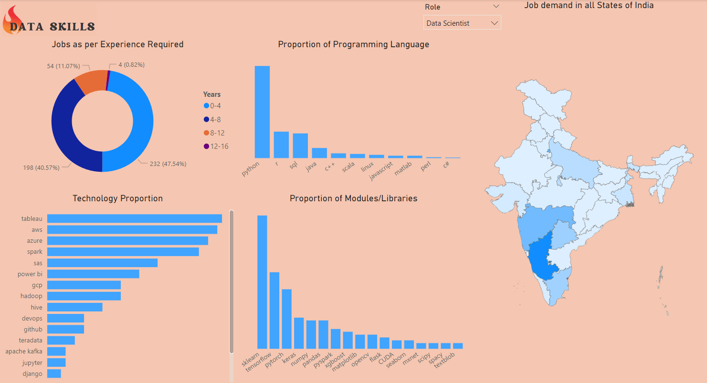

# Data Science Jobs Analysis
There are various roles in Data Science field such as **Data Engineer, Data Analyst and Data Scientist** which require different technologies and skills. So, this project was focused on **putting everything on a single interface and getting clarity on what tools and skills are in-demand for different roles.**
## Data Source
Data was scraped using **Power Automate from naukri.com** (Indian website for job search) and saved into **Excel**

## Data Cleaning/Transformation
Data was cleaned and processed in **Jupyter Notebook** (notebooks can be found in this repo). Then, the cleaned data was imported into **Power BI** and some final transformations were applied.

## Data Visualization/Business Intelligence
A custom map for India was uploaded to Power BI (map source is mentioned below) and mulitple interactive visuals were added to dashboard for an easy user experience and insights.

# References
- Map data: https://github.com/datameet/maps
- Jobs Data: https://www.naukri.com/
